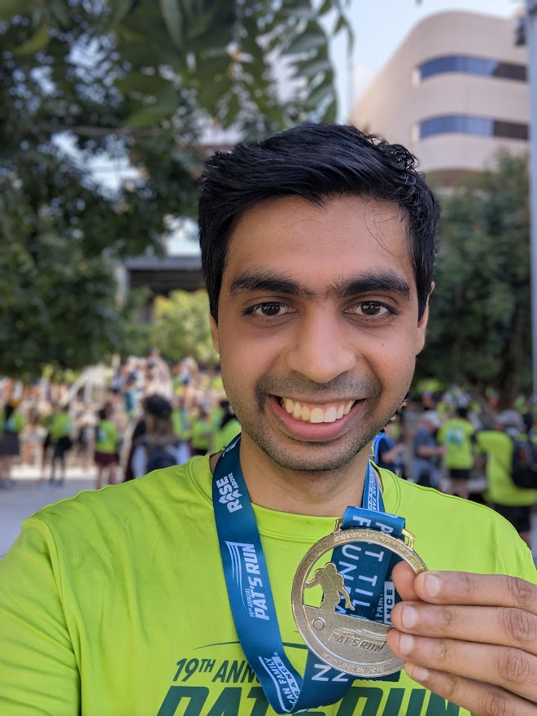
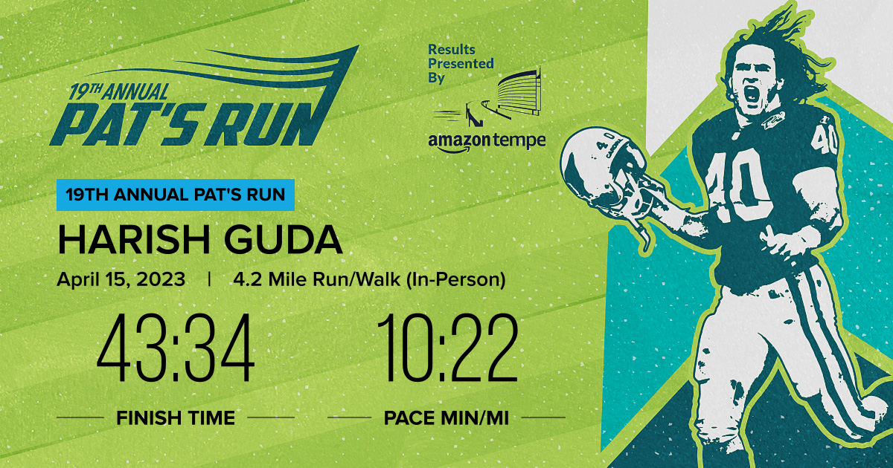

```{r setup, include=FALSE}
knitr::opts_chunk$set(echo = TRUE)
```

# Pat Tillman Run

One of my favorite runs in Tempe is the [Pat Tillman Run](https://pattillmanfoundation.org/pats-run/), organized by the Pat Tillman Foundation. 

The organization this year was great. I was surprised to see more than 28,000 participants in the event this year. Bib #'s and start times depend on self-reported time per mile. I (think) I gave something around 10 minutes/mile, so I was part of bib #'s 18,000-19,000. While the event was supposed to start at 7am, given the crowd, they started the race in phases. I was in the 18th batch, and my run started at around 7:45am. 

I was super under-prepared for this run. I didn't have a flipcase for my phone and keys, and I biked to the start zone (ASU football stadium). In hindsight, I am surprised I did as well as I did. I had a terrible day the previous day (struggled to prove some conjecture), and I went to bed quite late thinking about it. 

## The Course

<div class="strava-embed-placeholder" data-embed-type="activity" data-embed-id="8909540959"></div><script src="https://strava-embeds.com/embed.js"></script>

## Run

It was warm by the time I started -- AZ heat really sets in early. Thanks to the volunteers at every mile, I was well hydrated during the run. 

## Finish

Perhaps, my favorite part of a run is the finish. I could get a surge towards the end and managed to cut my target 45 minutes by a couple of minutes. The race ends at the 42nd yard of the ASU football stadium (42 for Tillman). 

Here's me at the end with a medal.


Here's the final timings based on the chip in my bib. 

